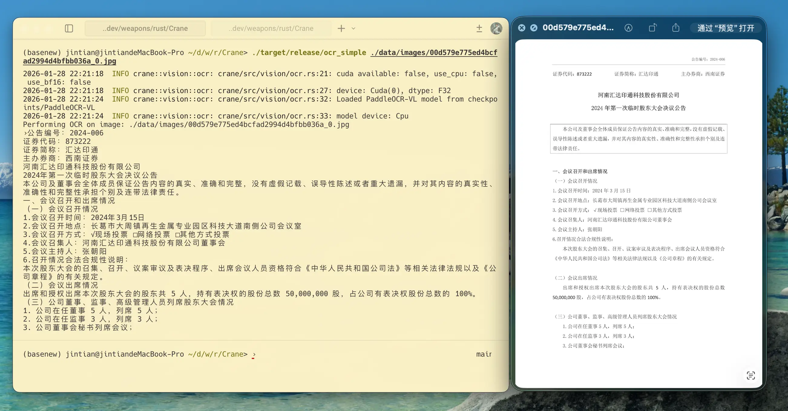

# Crane 🦩

> Crane focusing on accelerate LLM inference speed with the power of kernels in candle framework, while reducing development overhead, make it portable and fast run model on both CPU and GPU.


**Crane (🦩)** - **C**andle-based **R**ust **A**ccelerated **N**eural **E**ngine
A high-performance inference framework leveraging Rust's Candle for maximum speed on CPU/GPU.

**Supported Models**:

- [x] Qwen3 (0.6B ~ 30B+)
- [x] Qwen 2.5 (0.5B ~ 72B)
- [x] Qwen 3.5 (0.8B; hybrid Gated Delta Net + softmax attention, CPU/CUDA/Metal) + Ornith-1.0-9B (agentic, tool calling)
- [x] Hunyuan Dense
- [x] Gemma 4 (text and vision; no audio)
- [x] Qwen3 VL (2B, 4B)
- [x] PaddleOCR VL 0.9B / 1.5
- [x] Moonshine ASR
- [x] Silero VAD
- [x] 🎙️ Qwen3-TTS (12Hz, 24kHz, 16-codebook RVQGAN + native Candle decoder, voice cloning)
- [x] 🎙️ [Voxtral-4B-TTS](https://arxiv.org/abs/2603.25551) (12.5Hz, 24kHz, autoregressive + flow-matching, 20 preset voices across 10 languages)
- [ ] 🎙️ TTS: [Spark-TTS](https://github.com/SparkAudio/Spark-TTS) | [Orpheus-TTS](https://github.com/canopyai/Orpheus-TTS) (WIP)


submit your models make other users use it easier!


**You can run Qwen3-VL 2B with fast speed in local, 50x faster than native PyTorch on M1/M2/M3.**

**Key Advantages**:

- 🚀 **Blazing-Fast Inference**: Outperforms native PyTorch with Candle's optimized kernels
- 🦀 **Rust-Powered**: Eliminate C++ complexity while maintaining native performance
- 🍎 **Apple Silicon Optimized**: Achieve GPU acceleration via Metal on macOS devices
- 🤖 **Hardware Agnostic**: Unified codebase for CPU/CUDA/Metal execution
- 🌐 **OpenAI compatible API**: Supports OpenAI and SGLang interfaces


**Crane maybe the fastest (both speed and develop speed) framework you can use to build your AI applications!**

Crane using candle as the only dependencies, inference with **fastest** speed cross CPUs and GPUs, while your code can be compiled into binary same as llama.cpp does but much more clean and simpler.

**Most important!!!**
*Crane is not a low-level SDK, you can call AI abilities out-of-box with ease*.

We include:
- Basic LLM chat;
- VLM chat;
- OCR with VLM;
- VLA (on the way);
- TTS;
- ASR;
- VAD;
- .... (Any AI ability you want power with AI.)


## 🔥 Updates

- **`2026.07.03`**: 🗜️ Qwen 3.5 quantization & memory — load community **GGUF** files directly (`--model-path model.gguf`, llama.cpp `qwen35` layout incl. the hybrid GDN blocks, arch auto-detected from the header; put `tokenizer.json` next to the file), or quantize a safetensors checkpoint at load time with **`--quant q4k|q8_0|…`** / `CRANE_ISQ` (in-situ quantization via candle `QMatMul`, no conversion step). New **`--dtype f16|bf16|f32`** flag; Qwen 3.5 now defaults to **F16 on Apple Metal**. Qwen3.5-0.8B on Apple Silicon: ~1.2 GB (Q4_0 GGUF) / ~2.0 GB (F16, new default) / ~3.7 GB (old F32 default).
- **`2026.06.30`**: 🚀 Qwen 3.5 / Ornith follow-up — K=128 register-resident CUDA recurrence kernel (~5× prefill, ~7.8× recurrence-only on RTX 3090), per-token int8 / int4 K/V cache backends (~2× / ~4× smaller via `CRANE_KV_QUANT`), and Ornith tool-calling support (HF-byte-identical chat template via `AutoTokenizer::apply_chat_template_with_tools`, end-to-end `ornith_tools` example).
- **`2026.06.29`**: 🌀 Qwen 3.5 support — hybrid Mamba/Transformer (Gated Delta Net + softmax attention), runs on CPU, NVIDIA CUDA, and Apple Metal. New `crane-core/src/ops/gdn/` module with a fused CUDA recurrence kernel for the linear-attention path.
- **`2026.05.04`**: Gemma 4 support added for text and vision models (audio is not supported);
- **`2026.02.23`**: 🎙️ Qwen3-TTS support added — full Talker + Code Predictor transformer in Candle, native speech-tokenizer decoder (ONNX fallback), voice cloning (Base model ICL), OpenAI `/v1/audio/speech` endpoint in crane-serve;
- **`2026.02.18`**: ⚡ Qwen3 & Hunyuan Dense inference optimization: pre-allocated KV cache, GQA 4D matmul, fused RoPE with cache pre-growth, GGUF quantization, batched decode, smart sampling fallback for large vocabularies;
- **`2026.01.30`**: PaddleOCR-VL-1.5 supported now! model: https://huggingface.co/PaddlePaddle/PaddleOCR-VL-1.5/;
- **`2025.03.21`**: 🔥 Qwen2.5 a more transformers liked Rust interface were supported, you now use Crane just like in your python;
- **`2025.03.19`**: 🔥 project initialized;


## AI Abilities Use out-of-box

**1. OCR**




**2. more to come**


## 🧐 Why Choose Crane?

While traditional approaches face limitations:

- PyTorch's suboptimal inference performance
- llama.cpp's complex C++ codebase and model integration

Crane bridges the gap through:

1. **Candle Framework**: Combines Rust's efficiency with PyTorch-like ergonomics
2. **Cross-Platform Acceleration**: Metal GPU support achieves 3-5x speedup over CPU-only
3. **Simplified Deployment**: Add new models with <100 LOC in most cases

💡 **Pro Tip**: For macOS developers, Crane delivers comparable performance to llama.cpp with significantly lower maintenance overhead. You can use it out of box directly without any GGUF conversion or something like install llama.cpp etc.

Speed up your LLM inference speed on M series Apple Silicon devices to 6x with almost simillar code in your python (No quantization needed!):

```rust

use clap::Parser;
use crane_core::{
    Msg,
    autotokenizer::AutoTokenizer,
    chat::Role,
    generation::{GenerationConfig, based::ModelForCausalLM, streamer::TextStreamer},
    models::{DType, Device, qwen25::Model as Qwen25Model},
};

#[derive(Parser, Debug)]
#[clap(about, version, author)]
struct Args {
    #[clap(short('m'), long, default_value = "checkpoints/Qwen2.5-0.5B-Instruct")]
    model_path: String,
}

fn main() {
    crane_core::utils::utils::print_candle_build_info();

    let args = Args::parse();
    let dtype = DType::F16;
    let device = Device::Cpu;

    let tokenizer = AutoTokenizer::from_pretrained(&args.model_path, None).unwrap();
    let mut model = Qwen25Model::new(&args.model_path, &device, &dtype).unwrap();

    let gen_config = GenerationConfig {
        max_new_tokens: 235,
        temperature: Some(0.67),
        top_p: Some(1.0),
        repetition_penalty: 1.1,
        repeat_last_n: 1,
        do_sample: false,
        pad_token_id: tokenizer.get_token("<|end_of_text|>"),
        eos_token_id: tokenizer.get_token("<|im_end|>"),
        report_speed: true,
    };

    let chats = [
        Msg!(Role::User, "hello"),
        Msg!(Role::Assistant, "Hi, how are you?"),
        Msg!(Role::User, "I am OK, tell me some truth about Yoga."),
    ];
    let prompt = tokenizer.apply_chat_template(&chats, true).unwrap();
    println!("prompt templated: {:?}\n", prompt);

    let input_ids = model.prepare_inputs(&prompt).unwrap();
    let _ = model.warmup();

    let mut streamer = TextStreamer {
        tokenizer: tokenizer.clone(),
        buffer: String::new(),
    };
    let output_ids = model
        .generate(&input_ids, &gen_config, Some(&mut streamer))
        .map_err(|e| format!("Generation failed: {}", e))
        .unwrap();

    let res = tokenizer.decode(&output_ids, false).unwrap();
    println!("Output: {}", res);
}

```

Above is all the codes you need to run end2end chat in Qwen2.5 in pure Rust, nothing overhead compare with llama.cpp.

Then, your LLM inference is 6X faster on mac without Quantization! Enabling Quantization could be even faster!

For cli chat, run:

```
# download models of Qwen2.5
mkdir -p checkpoints/
huggingface-cli download Qwen/Qwen2.5-0.5B-Instruct --local-dir checkpoints/Qwen2.5-0.5B-Instruct
cargo run --bin qwenchat --release
```


## 📖 Usage

To use `crane`, here are some notes:

- `crane-core`: All models comes into core, this is a lib;
- `crane`: All Apps (runnable AI pipelines, such as Qwen2-Chat, Spark-TTS, Qwen2.5-VL etc), you can build your apps inside it, each app is a binary for demonstration purpose;
- `crane-serve`: OpenAI & SGLang compatible API server with continuous batching, see [crane-serve/README.md](crane-serve/README.md) for full documentation;

1. Make sure latest Rust were installed;
2. Build (choose based on your hardware):

   ```bash
   # CPU
   cargo build --release

   # CUDA (GPU)
   cargo build --release --features cuda
   ```

That's it!

### OpenAI API Server

Start a server compatible with OpenAI SDK and SGLang client:

```bash
# Build
# CPU
cargo build -p crane-serve --release
# CUDA
cargo build -p crane-serve --release --features cuda

# Start (auto-detect model type and device)
./target/release/crane --model-path /path/to/Qwen2.5-7B-Instruct

# Or run directly
cargo run -p crane-serve --release -- --model-path /path/to/model --port 8000
```

Then use it with any OpenAI-compatible client:

```python
from openai import OpenAI

client = OpenAI(base_url="http://localhost:8000/v1", api_key="not-needed")
response = client.chat.completions.create(
    model="Qwen2.5-7B-Instruct",
    messages=[{"role": "user", "content": "Hello!"}],
)
print(response.choices[0].message.content)
```

Supported endpoints:

| Family | Endpoint | Description |
|--------|----------|-------------|
| OpenAI | `POST /v1/chat/completions` | Chat completions (streaming & non-streaming) |
| OpenAI | `POST /v1/completions` | Text completions |
| OpenAI | `POST /v1/audio/speech` | Text-to-speech (Qwen3-TTS) |
| OpenAI | `GET /v1/models` | List models |
| OpenAI | `POST /v1/tokenize` | Tokenize text |
| OpenAI | `POST /v1/detokenize` | Detokenize tokens |
| SGLang | `POST /generate` | Native text generation |
| SGLang | `GET /model_info` | Model metadata |
| SGLang | `GET /server_info` | Server stats |
| SGLang | `GET /health_generate` | Deep health check |
| Mgmt   | `GET /health` | Health check |
| Mgmt   | `GET /v1/stats` | Engine statistics |

✨ **Text-to-Speech (Qwen3-TTS)**: For TTS models, the server adds a `/v1/audio/speech` endpoint (OpenAI-compatible). Both **CustomVoice** (predefined speakers) and **Base** (voice cloning via reference audio) models are supported. `response_format` currently supports `wav` and `pcm` (other formats return `400`). See [crane-serve/README.md](crane-serve/README.md) for full TTS API documentation.

### TTS Examples

```bash
# CustomVoice — predefined speakers
cargo run --bin tts_custom_voice --release -- vendor/Qwen3-TTS-12Hz-0.6B-CustomVoice

# Voice Clone — clone speech from reference audio (Base model)
cargo run --bin tts_voice_clone --release -- vendor/Qwen3-TTS-12Hz-0.6B-Base

# Auto-detect model type
cargo run --bin tts_simple --release -- vendor/Qwen3-TTS-12Hz-0.6B-Base
```

All TTS examples save generated audio files to `data/audio/output`.

### TTS Audio Samples

- Base (voice clone): [vc1_base.wav](data/audio/output/vc1_base.wav), [vc2_base.wav](data/audio/output/vc2_base.wav)
- CustomVoice: [custom_voice_zh.wav](data/audio/output/custom_voice_zh.wav), [custom_voice_en.wav](data/audio/output/custom_voice_en.wav), [custom_voice_ja.wav](data/audio/output/custom_voice_ja.wav)

### Qwen 3.5 / Ornith (hybrid Gated Delta Net + softmax attention)

Qwen 3.5 is a hybrid architecture: most layers are Gated Delta Net linear
attention (recurrent, constant-size state per layer), every 4th layer is
softmax attention (cumulative K/V cache). On RTX 3090 with `Qwen3.5-0.8B`,
prefill argmax matches HuggingFace Transformers bit-exactly in f32/f16/bf16
(`token 283 " ="` on a 512-token prefill); decoding is coherent on CPU,
CUDA, and Metal.

**Run:**

```bash
cargo run --bin chat_simple --release   # auto-targets Qwen 3.5
# Point chat_simple.rs at your local Qwen3.5-0.8B or Ornith-1.0-9B path
```

**Tool calling (Ornith-1.0-9B):** Ornith is an agentic variant of the
Qwen3.5 architecture with a `# Tools` system block and a `<tool_call>…/tool`
turn protocol. `AutoTokenizer::apply_chat_template_with_tools` renders this
with byte-identical output to HuggingFace's tokenizer (Python-style
`tojson`, `raise_exception`, `serde_json` with `preserve_order`).
See `example/src/ornith_tools.rs` for an end-to-end agentic loop
(reason → tool_call → run tool → tool turn → answer):

```bash
cargo run -p crane-examples --bin ornith_tools --release --features cuda \
  -- --model-path /path/to/Ornith-1.0-9B
# or:  MODEL_PATH=/path/to/Ornith-1.0-9B cargo run --bin ornith_tools ...
```

**K/V cache compression (CUDA):** the full-attention K/V cache dominates
memory at long context (the GDN layers carry a constant recurrent state).
Pick the representation per-model-load via `CRANE_KV_QUANT`:

| `CRANE_KV_QUANT` | Storage              | vs fp16 | Notes                                    |
|------------------|----------------------|--------:|------------------------------------------|
| unset (default)  | fp16 / bf16          |    1.0× | lossless                                 |
| `int8`           | per-token symmetric  |  ~0.56× | ~2× smaller, dequantized on read         |
| `int4`           | nibble-packed        |  ~0.31× | ~4× smaller; requires even `head_dim`    |

Measured at 4 K tokens, full-attention K+V across all layers of the
Qwen3.5-0.8B architecture (24 layers, full-attention every 4th). At
Ornith-9B's full 262K-token window, int4 is what lets a single agent
hold the whole window locally on a 24 GB GPU.

**Other toggles:**

- `CRANE_GDN_PORTABLE=1` — force the op-by-op GDN recurrence path on CUDA
  instead of the fused kernel (cross-check numerics).
- `CRANE_FULL_RECOMPUTE=1` — force the O(n²) reset-and-reprocess decode
  path (debugging cross-check for the incremental path).
- `cargo run -p crane-core --release --features cuda --bin gdn_bench` —
  micro-benchmark for the fused GDN recurrence in isolation.

**Limitation:** the Qwen 3.5 backend caps `max_concurrent=1` — KV swap
and batched decode aren't implemented yet (hybrid layer types complicate
a generic GPU-batched implementation).

✨ **Multimodal & Vision support**: For models like PaddleOCR-VL, the endpoints accept OpenAI's structured `messages.[]content.[{type: "image_url", image_url: {url: "..."}}]` payload or SGLang's `image_url` field. See [crane-serve/README.md](crane-serve/README.md) for full API documentation with request/response examples.

Now you can run LLM extremly fast (about 6x faster than vanilla transformers on M1)!

## 📁 Project Structure

```
Crane/
├── crane-core/          # Core library: model implementations, tokenizer, generation
│   ├── src/models/      # Model architectures (Qwen 2.5, Qwen 3, Qwen 3.5, Hunyuan, etc.)
│   └── src/ops/gdn/     # Gated Delta Net (Qwen 3.5 linear-attention path) + fused CUDA kernel
├── crane/               # High-level SDK: Chat, Vision, Audio, Multimodal clients
├── crane-serve/         # OpenAI & SGLang compatible API server
│   └── src/
│       ├── engine/      # Continuous batching inference engine
│       ├── handlers/    # HTTP request handlers (OpenAI, SGLang, common)
│       ├── openai_api.rs # OpenAI request/response types
│       ├── sglang_api.rs # SGLang API types
│       └── main.rs      # CLI entry point & router
├── example/             # Example binaries (chat, ASR, vision, OCR, TTS, ornith_tools)
├── vendor/              # Vendored references (llama.cpp, sglang, vllm)
└── scripts/             # Utility scripts
```

## 🍺 Contribution

PR are welcomed right now! Since we need support a brand range of new models, but both Crane and HuggingFace's Candle is very limited model scope, so please join and help!

1. How to add a new model?

Generally speaking, you can reference to: `crane-core/src/models/siglip2.rs` for support new model, and all new added models should placed into `crane-core/src/models` and add `pub mod` in `crane-core/src/models/mod.rs` .

For me, the easiest way is to using Claude 3.7 to help write Rust conversion from pytorch code into Rust Candle code, and then manually fixing issues, once the float values of output are matched, the model can be ready to go.

2. How to support a new arch?

As all we know, a TTS model or any model based on LLM, it might consist of different modules, for example, in Spark-TTS, we will have a BiCodec Model before LLM, these module can be made into a separated module, and for Spark-TTS itself, we can gathering all module to inference it correctly.

One can reference to `crane-core/src/models/namo2.rs` for new arch add, which uses `Siglip2`, `mm_projector`, `Qwen2.5` to support a VL model.


## ⚡ Inference Optimizations

Crane implements production-grade inference optimizations for **Qwen3**,
**Hunyuan Dense**, and **Qwen 3.5 / Ornith**.

Sampling-related environment variables:

| Variable | Default | Description |
|----------|---------|-------------|
| `CRANE_FORCE_GPU_TOPK` | `0` | Force GPU topk sampling even for large vocabularies |
| `CRANE_TOPP_FALLBACK_TOPK` | `64` | Top-k size when top_p is active and GPU path is used |
| `CRANE_TOPK_SAMPLE_ON_CPU` | `0` | Force CPU sampling after GPU topk |
| `CRANE_SAMPLE_TRACE` | `0` | Enable detailed sampling timing logs |

Qwen 3.5 / Ornith environment variables (see the
[Qwen 3.5 / Ornith section](#qwen-35--ornith-hybrid-gated-delta-net--softmax-attention)
above for context):

| Variable | Default | Description |
|----------|---------|-------------|
| `CRANE_GDN_PORTABLE` | unset | Force the portable op-by-op GDN recurrence path on CUDA (skip the fused kernel) |
| `CRANE_KV_QUANT` | unset | K/V cache representation: `int8` (≈2× smaller) or `int4` (≈4× smaller); unset = fp |
| `CRANE_FULL_RECOMPUTE` | unset | Force the O(n²) reset-and-reprocess decode path (debugging cross-check) |
| `CRANE_GDN_VTILE` | unset | V-column tile size for the fused CUDA GDN kernel (advanced tuning) |

## ⚡️ Speed

Here are some speedup compare between **Crane** can other framework.

f32:

| Model/Platform | mac M1 metal | mac M1 cpu | mac M4 metal | v100 GPU | pytorch |
| -------------- | ------------- | ---------- | ------------ | -------- | ------- |
| Qwen2.5-500M   | 17.5 t/s      | 14 t/s     | /            |          | 6.9 t/s |
| Qwen2.5-VL-3B  | /             | /          | /            |          |         |

f16:

| Model/Platform | mac M1 metal | mac M1 metal 16  | mac M4 metal 16 | pytorch |
| -------------- | ------------- | ---------------- | --------------- | ------- |
| Qwen2.5-500M   | 17.5 t/s      | **35 t/s** | /               | 6.9 t/s |
| Qwen2.5-VL-3B  | /             | /                | /               |         |

- *Crane* is blazing fast on macOS with metal, useful for you to run local models;
- int8 quantization still on the way, it's even faster!


## 📑 Citation

If you use Crane in your research or projects, please cite using BibTeX:

```bibtex
@misc{Crane,
  author       = {lucasjinreal},
  title        = {{Crane: Candle-based Rust Accelerated Neural Engine}},
  howpublished = {\url{https://github.com/lucasjinreal/Crane}},
  year         = {2025}
}
```
