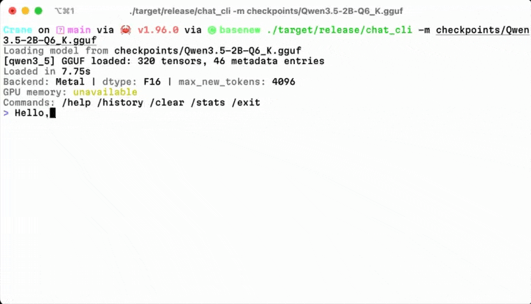
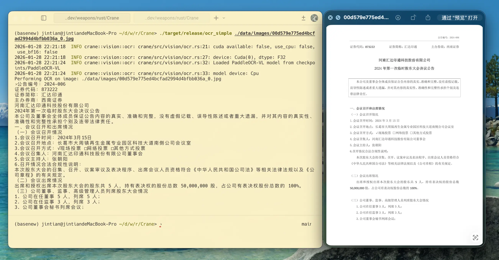

<div align="center">


</div>

<div align="center">
<h1>Crane 🦩</h1>
</div>

> Crane focusing on accelerate LLM inference speed with the power of kernels in candle framework, while reducing development overhead, make it portable and fast run model on both CPU and GPU.


**Crane (🦩)** - **C**andle-based **R**ust **A**ccelerated **N**eural **E**ngine
A high-performance inference framework leveraging Rust's Candle for maximum speed on CPU/GPU.

**Supported Models**:

- [ ] more to come....
- [ ] Qwen3.5-VLA, Qwen3.5-GR00T, Pi0.5;
- [ ] Audio8-TTS;
- [x] PaddleOCR-v6;
- [x] Qwen 3.6 / Qwen 3.8 (27B dense, text + vision, thinking control) — same architecture as Qwen 3.5, scaled up
- [x] Qwen 3.5 (0.8B; hybrid Gated Delta Net + softmax attention, CPU/CUDA/Metal) + Ornith-1.0-9B (agentic, tool calling)
- [x] Hunyuan Dense
- [x] Gemma 4 (text and vision; no audio)
- [x] Qwen3 VL (2B, 4B)
- [x] PaddleOCR VL 0.9B / 1.5
- [x] Qwen3 (0.6B ~ 30B+)
- [x] Qwen 2.5 (0.5B ~ 72B)
- [x] Moonshine ASR
- [x] Silero VAD
- [x] 🎙️ Qwen3-TTS (12Hz, 24kHz, 16-codebook RVQGAN + native Candle decoder, voice cloning)
- [x] 🎙️ [Voxtral-4B-TTS](https://arxiv.org/abs/2603.25551) (12.5Hz, 24kHz, autoregressive + flow-matching, 20 preset voices across 10 languages)
- [x] 🎼 [MuScriptor](https://huggingface.co/MuScriptor) (small / medium / large — automatic music transcription, audio → multi-track MIDI)
- [ ] ~~🎙️ TTS: [Spark-TTS](https://github.com/SparkAudio/Spark-TTS) | [Orpheus-TTS](https://github.com/canopyai/Orpheus-TTS) (WIP)~~


submit your models make other users use it easier!


**You can run Qwen3-VL 2B with fast speed in local, 50x faster than native PyTorch on M1/M2/M3.**

**Key Advantages**:

- 🚀 **Blazing-Fast Inference**: Outperforms native PyTorch with Candle's optimized kernels
- 🦀 **Rust-Powered**: Eliminate C++ complexity while maintaining native performance
- 🍎 **Apple Silicon Optimized**: Achieve GPU acceleration via Metal on macOS devices
- 🤖 **Hardware Agnostic**: Unified codebase for CPU/CUDA/Metal execution
- 🌐 **OpenAI compatible API**: Supports OpenAI and SGLang interfaces


**Crane maybe the fastest (both speed and develop speed) framework you can use to build your AI applications!**

Crane using candle as the only dependencies, inference with **fastest** speed cross CPUs and GPUs, while your code can be compiled into binary same as llama.cpp does but much more clean and simpler.

**Most important!!!**
*Crane is not a low-level SDK, you can call AI abilities out-of-box with ease*.

We include:
- Basic LLM chat;
- VLM chat;
- OCR with VLM;
- VLA (on the way);
- TTS;
- ASR;
- VAD;
- .... (Any AI ability you want power with AI.)





## 🔥 Updates

- **`2026.08.16`**: 🧠 **Qwen 3.8 / Qwen 3.6 (27B) support + flexible thinking control.** Both declare `model_type: "qwen3_5"` and convert to GGUF as `qwen35`, so they are the Qwen 3.5 architecture scaled up (64 layers, 24 q / 4 KV heads, 48 GDN value heads, untied `lm_head`) and need **no new modeling code** — every difference is a config value. Thinking is now controllable per request via `chat_template_kwargs: {"enable_thinking": …, "reasoning_effort": "low|medium|xhigh"}` (or OpenAI's top-level `reasoning_effort`), and the `<think>` scratchpad is separated out of `content` into **`reasoning_content`**, streaming included. 🗜️ GGUF embedding tables now stay quantized and dequantize only the rows a forward pass gathers, instead of expanding all 248320 of them at load: **1772 MiB saved** on Qwen 3.8-27B Q4_K_M (peak 22007 → 20235 MiB), bit-exact on untied checkpoints (prefill logits cosine `1.000000000`). Qwen 3.8-27B Q4_K_M runs text-only on a single 24 GB RTX 3090.
- **`2026.08.15`**: 🎼 **MuScriptor support** — automatic music transcription, audio → multi-track Standard MIDI File. Decoder-only transformer with a mel-spectrogram prefix conditioner (small/medium/large, [MuScriptor org on HuggingFace](https://huggingface.co/MuScriptor)); transcribes audio of any length by chunking into 5 s windows with tie-prologue forcing across chunk boundaries so notes sustained across a boundary keep the right instrument. Greedy or sampled (temperature/top-k/top-p) decoding, plus `--dtype f16|bf16` and `--quant q4k|q8_0|…` in-situ quantization (conditioners always stay F32) — `large` goes **7.1 GB → 2.2 GB** peak VRAM at f16+q4k on an RTX 3090 (trades wall-clock for it; `--dtype f16` alone is smaller *and* a bit faster with none of that tradeoff). See [the MuScriptor section](#muscriptor-automatic-music-transcription) below.
- **`2026.08.06`**: 🗣️ **Kokoro-82M TTS support** — from-scratch Rust G2P + `candle-onnx` synthesis pipeline, currently English only, wired into `/v1/audio/speech` in crane-serve. Benchmarked against Moonshine-TTS's reference C++ implementation on the same Kokoro-82M ONNX model: **1.6-4.3x faster synthesis** across short/medium/long text.
- **`2026.08.02`**: ⏱️ Decode is dispatch-bound, not kernel-bound — and now isn't. New `CRANE_PROF=1` forward-pass profiler measures *submission* time against wall-clock time after a device sync, which `rocm-smi`'s busy counter cannot distinguish. It showed the CPU spending **21.8 ms of a 26.9 ms token** merely enqueueing ~2000 kernel launches. Collapsing `Qwen35RmsNorm` and the GDN gated norm into single fused `rms_norm` launches, rewriting the Q/K L2 norm as one (`x/√(Σx²+ε) ≡ rms_norm(x, 1/√K, ε/K)` — an identity, not an approximation), and hoisting `-exp(A_log)`/`dt_bias` to load time cut submission to **6.9 ms**; decode is now GPU-bound. On an RX 7800 XT with Qwen3.5-2B-Q8_0: decode **35.7 → 63.0 t/s** @ depth 0, **31.7 → 55.6** @ 2048, **28.8 → 49.2** @ 4096; prefill **2257 → 2726 t/s**. Gap to llama.cpp: 3.0× → ~1.7×.
- **`2026.08.01`**: 🔴 AMD ROCm kernels — Crane's own `kernels/cuda/*.cu` now run on AMD too (the ROCm build compiles them with `hipcc` on first use and caches the code object), so the fused GDN recurrence, GPU top-k sampling and `fused_silu_mul` are no longer CUDA-only. The causal Conv1D also became `kernel` shifted multiply-accumulates instead of one windowed reduction per timestep, which helps every backend. Qwen 3.5's GGUF loader also stops forcing F32 side tensors (embeddings, norms, attention scores) on ROCm — F16 like Metal. On an RX 7800 XT with Qwen3.5-2B-Q8_0: prefill **183 → ~1600 t/s**, decode @ depth 2048 **15.4 → 30.6 t/s**, and peak VRAM on a 3800-token prompt drops from 99% to 69% of 16 GB.
- **`2026.07.03`**: 🗜️ Qwen 3.5 quantization & memory — load community **GGUF** files directly (`--model-path model.gguf`, llama.cpp `qwen35` layout incl. the hybrid GDN blocks, arch auto-detected from the header, tokenizer + chat-template read from GGUF metadata so **no sibling files required**), or quantize a safetensors checkpoint at load time with **`--quant q4k|q8_0|…`** / `CRANE_ISQ` (in-situ quantization via candle `QMatMul`, no conversion step). New **`--dtype f16|bf16|f32`** flag; Qwen 3.5 now defaults to **F16 on Apple Metal**. 🖼️ **Qwen 3.5 vision** — multimodal checkpoints (`Qwen3_5ForConditionalGeneration`) work end-to-end via `--model-type qwen3_5_vl`: smart-resize + ViT + 2×2-spatial-merge + 3D MRoPE on the hybrid decoder, `/v1/chat/completions` accepts OpenAI-style `image_url` content parts (remote URL or `data:image/...;base64,...`). End-to-end example: `cargo run --release --features cuda --example qwen3_5_vl_chat`. Qwen3.5-0.8B on Apple Silicon: ~1.2 GB (Q4_0 GGUF) / ~2.0 GB (F16, new default) / ~3.7 GB (old F32 default).
- **`2026.06.30`**: 🚀 Qwen 3.5 / Ornith follow-up — K=128 register-resident CUDA recurrence kernel (~5× prefill, ~7.8× recurrence-only on RTX 3090), per-token int8 / int4 K/V cache backends (~2× / ~4× smaller via `CRANE_KV_QUANT`), and Ornith tool-calling support (HF-byte-identical chat template via `AutoTokenizer::apply_chat_template_with_tools`, end-to-end `ornith_tools` example).
- **`2026.06.29`**: 🌀 Qwen 3.5 support — hybrid Mamba/Transformer (Gated Delta Net + softmax attention), runs on CPU, NVIDIA CUDA, and Apple Metal. New `crane-core/src/ops/gdn/` module with a fused CUDA recurrence kernel for the linear-attention path.
- **`2026.05.04`**: Gemma 4 support added for text and vision models (audio is not supported);
- **`2026.02.23`**: 🎙️ Qwen3-TTS support added — full Talker + Code Predictor transformer in Candle, native speech-tokenizer decoder (ONNX fallback), voice cloning (Base model ICL), OpenAI `/v1/audio/speech` endpoint in crane-serve;
- **`2026.02.18`**: ⚡ Qwen3 & Hunyuan Dense inference optimization: pre-allocated KV cache, GQA 4D matmul, fused RoPE with cache pre-growth, GGUF quantization, batched decode, smart sampling fallback for large vocabularies;
- **`2026.01.30`**: PaddleOCR-VL-1.5 supported now! model: https://huggingface.co/PaddlePaddle/PaddleOCR-VL-1.5/;
- **`2025.03.21`**: 🔥 Qwen2.5 a more transformers liked Rust interface were supported, you now use Crane just like in your python;
- **`2025.03.19`**: 🔥 project initialized;


## AI Abilities Use out-of-box

**1. OCR**




**2. ASR with Qwen3-ASR**

Multi-language support, extremly fast speed compare with pytorch and other framework:


Runs almost real-time on my old mac, just try it! serve any app.


**2. more to come**


## 🧐 Why Choose Crane?

While traditional approaches face limitations:

- PyTorch's suboptimal inference performance
- llama.cpp's complex C++ codebase and model integration

Crane bridges the gap through:

1. **Candle Framework**: Combines Rust's efficiency with PyTorch-like ergonomics
2. **Cross-Platform Acceleration**: Metal GPU support achieves 3-5x speedup over CPU-only
3. **Simplified Deployment**: Add new models with <100 LOC in most cases

💡 **Pro Tip**: For macOS developers, Crane delivers comparable performance to llama.cpp with significantly lower maintenance overhead. You can use it out of box directly without any GGUF conversion or something like install llama.cpp etc.

Speed up your LLM inference speed on M series Apple Silicon devices to 6x with almost simillar code in your python (No quantization needed!):

```rust

use clap::Parser;
use crane_core::{
    Msg,
    autotokenizer::AutoTokenizer,
    chat::Role,
    generation::{GenerationConfig, based::ModelForCausalLM, streamer::TextStreamer},
    models::{DType, Device, qwen25::Model as Qwen25Model},
};

#[derive(Parser, Debug)]
#[clap(about, version, author)]
struct Args {
    #[clap(short('m'), long, default_value = "checkpoints/Qwen2.5-0.5B-Instruct")]
    model_path: String,
}

fn main() {
    crane_core::utils::utils::print_candle_build_info();

    let args = Args::parse();
    let dtype = DType::F16;
    let device = Device::Cpu;

    let tokenizer = AutoTokenizer::from_pretrained(&args.model_path, None).unwrap();
    let mut model = Qwen25Model::new(&args.model_path, &device, &dtype).unwrap();

    let gen_config = GenerationConfig {
        max_new_tokens: 235,
        temperature: Some(0.67),
        top_p: Some(1.0),
        repetition_penalty: 1.1,
        repeat_last_n: 1,
        do_sample: false,
        pad_token_id: tokenizer.get_token("<|end_of_text|>"),
        eos_token_id: tokenizer.get_token("<|im_end|>"),
        report_speed: true,
    };

    let chats = [
        Msg!(Role::User, "hello"),
        Msg!(Role::Assistant, "Hi, how are you?"),
        Msg!(Role::User, "I am OK, tell me some truth about Yoga."),
    ];
    let prompt = tokenizer.apply_chat_template(&chats, true).unwrap();
    println!("prompt templated: {:?}\n", prompt);

    let input_ids = model.prepare_inputs(&prompt).unwrap();
    let _ = model.warmup();

    let mut streamer = TextStreamer {
        tokenizer: tokenizer.clone(),
        buffer: String::new(),
    };
    let output_ids = model
        .generate(&input_ids, &gen_config, Some(&mut streamer))
        .map_err(|e| format!("Generation failed: {}", e))
        .unwrap();

    let res = tokenizer.decode(&output_ids, false).unwrap();
    println!("Output: {}", res);
}

```

Above is all the codes you need to run end2end chat in Qwen2.5 in pure Rust, nothing overhead compare with llama.cpp.

Then, your LLM inference is 6X faster on mac without Quantization! Enabling Quantization could be even faster!

For cli chat, run:

```
# download models of Qwen2.5
mkdir -p checkpoints/
huggingface-cli download Qwen/Qwen2.5-0.5B-Instruct --local-dir checkpoints/Qwen2.5-0.5B-Instruct
cargo run --bin qwenchat --release
```


## 📖 Usage

To use `crane`, here are some notes:

- `crane-core`: All models comes into core, this is a lib;
- `crane`: All Apps (runnable AI pipelines, such as Qwen2-Chat, Spark-TTS, Qwen2.5-VL etc), you can build your apps inside it, each app is a binary for demonstration purpose;
- `crane-serve`: OpenAI & SGLang compatible API server with continuous batching, see [crane-serve/README.md](crane-serve/README.md) for full documentation;

1. Make sure latest Rust were installed;
2. Build (choose based on your hardware):

   ```bash
   # CPU
   cargo build --release

   # Metal GPU + Accelerate CPU math (macOS)
   cargo build --release --features "metal,accelerate"

   # CUDA (GPU)
   cargo build --release --features cuda
   ```

That's it!

#### AMD / ROCm (experimental)

ROCm/HIP support targets AMD Radeon GPUs (developed on an RX 7800 XT, gfx1101). It
depends on a **local candle fork** with a ROCm backend, wired in via `[patch.crates.io]`
in the root `Cargo.toml` — adjust those paths if your fork lives elsewhere.

```bash
export ROCM_PATH=/opt/rocm
export HIP_PATH=/opt/rocm
export LD_LIBRARY_PATH=$ROCM_PATH/lib:$LD_LIBRARY_PATH
cargo build --release --features rocm
```

Crane's own kernels (`crane-core/kernels/cuda/*.cu`) run on ROCm too: the CUDA build compiles
them to PTX at `cargo build` time, while the ROCm build hands the same sources to `hipcc`
on first use and caches the code object on disk. So the fused GDN recurrence, the GPU
top-k sampler and `fused_silu_mul` are all live on AMD. Cross-check the kernels against
the portable reference on your own device with:

```bash
cargo test -p crane-core --release --features rocm --test rocm_kernels
```

Current limitations:

- **Dense models are what has been exercised.** candle's ROCm backend has since gained
  the quantized MoE forward paths, but no MoE model has been run through Crane on ROCm,
  so treat it as untested rather than known-good.
- Decode is ~1.7× behind llama.cpp on the same weights, down from ~3×. The earlier
  reading of that gap — "the GPU stays ~93% busy, so what is left is kernel efficiency,
  not launch overhead in Crane" — was wrong: `rocm-smi`'s busy counter samples whether a
  kernel is *resident*, not whether the queue starves between thousands of
  microsecond-scale launches, so it reads high either way. Measuring submission time
  directly (`CRANE_PROF=1`) showed the CPU spent 21.8 ms of a 26.9 ms token just
  enqueueing work. Collapsing the norm op-chains into fused `rms_norm` launches and
  hoisting per-token-invariant gate constants to load time cut that to 6.9 ms, and decode
  is now GPU-bound (~45% of the token is submission). What remains really is
  quantized-matmul efficiency in candle's ROCm backend.
- Attention still materialises a `[batch, heads, chunk, context]` score matrix. Chunked
  prefill bounds the query dimension, so peak VRAM now grows *linearly* with context
  instead of quadratically, but a fused (flash-style) attention kernel is what would
  remove the score matrix altogether. Single-sequence only: the qwen3_5 backend runs
  `max_concurrent=1`, so nothing amortises across requests.
- When VRAM does run out, the failure often surfaces as `rocrand ... status 107` — that is
  a *launch* failure caused by the exhaustion, not an RNG problem. Serving a wide range of
  prompt lengths from one process makes exhaustion likelier, because the caching allocator
  retains a bucket set per shape it has seen.

#### Intel GPU / SYCL (proof-of-concept)

SYCL/oneAPI support targets Intel GPUs. candle 0.11 on crates.io has no `sycl`
feature, so the root `Cargo.toml` `[patch.crates-io]` points
`candle-core`/`candle-nn`/`candle-transformers` at
[`Hahihula/candle`](https://github.com/Hahihula/candle) — candle 0.11.0 plus an
**off-by-default** `sycl` feature (native rms_norm / softmax / rope / sigmoid
kernels + a small `pub` launch surface). With `sycl` off that fork is stock
candle, so CPU/CUDA/Metal builds are unchanged. POC only, not for `main`.

Needs the Intel oneAPI toolchain (`icpx`, oneMKL) and the Level-Zero GPU runtime;
the `intel/oneapi-basekit` image bundles both, and `--device /dev/dri` exposes an
Intel GPU (`sycl-ls` should list a `level_zero:gpu` entry). `--features sycl`
selects `DeviceConfig::Sycl(0)` in the examples / `crane-serve` device ladder
(`Device::new_sycl`) and builds `crane-core/kernels/sycl/gdn.cpp` into
`libcrane_gdn_sycl.so` — a **fused Gated Delta Net recurrence** kernel, the SYCL
counterpart of `kernels/cuda/gdn.cu`.

```bash
source /opt/intel/oneapi/setvars.sh          # skip inside the oneAPI container
cargo build --release --features sycl
cargo run  --release --features sycl -p crane-examples --bin chat_cli -- \
    -m /path/to/Qwen3.5-0.8B
```

`libcandle_sycl.so` / `libcrane_gdn_sycl.so` are linked by rpath into an rlib and
that rpath doesn't reach the final binary, so add their `OUT_DIR`s to
`LD_LIBRARY_PATH` when running (do not clobber the image's oneAPI paths). A
one-shot containerised build/run/test recipe that handles all of this lives in
[`contrib/sycl/`](contrib/sycl/).

Verified on an Intel Arc iGPU (Meteor Lake): `Qwen3-0.6B` (dense) and
**`Qwen3.5-0.8B`** (hybrid GDN + attention) generate coherent text. The fused GDN
kernel matches the portable reference (`cos = 1.0`, `--test sycl_kernels`) and is
~15% faster at decode (3.8 → 4.4 tok/s); `CRANE_GDN_PORTABLE=1` forces the
op-by-op path. It's a naive v0 (no shared-memory staging), so there is headroom.

### OpenAI API Server

Start a server compatible with OpenAI SDK and SGLang client:

```bash
# Build
# CPU
cargo build -p crane-serve --release
# Metal GPU + Accelerate CPU math (macOS)
cargo build -p crane-serve --release --features "metal,accelerate"
# CUDA
cargo build -p crane-serve --release --features cuda
# AMD ROCm (experimental — see "AMD / ROCm" above for required env)
cargo build -p crane-serve --release --features rocm

# Start (auto-detect model type and device)
./target/release/crane --model-path /path/to/Qwen2.5-7B-Instruct

# Or run directly
cargo run -p crane-serve --release -- --model-path /path/to/model --port 8000
```

Then use it with any OpenAI-compatible client:

```python
from openai import OpenAI

client = OpenAI(base_url="http://localhost:8000/v1", api_key="not-needed")
response = client.chat.completions.create(
    model="Qwen2.5-7B-Instruct",
    messages=[{"role": "user", "content": "Hello!"}],
)
print(response.choices[0].message.content)
```

Supported endpoints:

| Family | Endpoint | Description |
|--------|----------|-------------|
| OpenAI | `POST /v1/chat/completions` | Chat completions (streaming & non-streaming) |
| OpenAI | `POST /v1/completions` | Text completions |
| OpenAI | `POST /v1/audio/speech` | Text-to-speech (Qwen3-TTS) |
| OpenAI | `GET /v1/models` | List models |
| OpenAI | `POST /v1/tokenize` | Tokenize text |
| OpenAI | `POST /v1/detokenize` | Detokenize tokens |
| SGLang | `POST /generate` | Native text generation |
| SGLang | `GET /model_info` | Model metadata |
| SGLang | `GET /server_info` | Server stats |
| SGLang | `GET /health_generate` | Deep health check |
| Mgmt   | `GET /health` | Health check |
| Mgmt   | `GET /v1/stats` | Engine statistics |

✨ **Text-to-Speech (Qwen3-TTS)**: For TTS models, the server adds a `/v1/audio/speech` endpoint (OpenAI-compatible). Both **CustomVoice** (predefined speakers) and **Base** (voice cloning via reference audio) models are supported. `response_format` currently supports `wav` and `pcm` (other formats return `400`). See [crane-serve/README.md](crane-serve/README.md) for full TTS API documentation.

## Using with opencode

[opencode](https://opencode.ai/) can talk to crane-serve as a custom
OpenAI-compatible provider. crane-serve has no auth layer and ignores the
`model` field in requests (it always serves whatever was loaded via
`--model-path`/`--model-name` at startup), so any placeholder API key and
model ID work.

Start crane-serve:

```bash
cargo run -p crane-serve --release --features cuda -- \
  --model-path /path/to/your/model \
  --model-name my-crane-model \
  --port 8080
```

Add a custom provider in `opencode.json` (project root) or
`~/.config/opencode/opencode.json`:

```json
{
  "$schema": "https://opencode.ai/config.json",
  "provider": {
    "crane": {
      "npm": "@ai-sdk/openai-compatible",
      "name": "Crane",
      "options": {
        "baseURL": "http://localhost:8080/v1",
        "apiKey": "not-needed"
      },
      "models": {
        "my-crane-model": { "name": "My Crane Model" }
      }
    }
  }
}
```

Restart opencode and select the `Crane` provider via `/models`.

### TTS Examples

```bash
# CustomVoice — predefined speakers
cargo run --bin tts_custom_voice --release -- vendor/Qwen3-TTS-12Hz-0.6B-CustomVoice

# Voice Clone — clone speech from reference audio (Base model)
cargo run --bin tts_voice_clone --release -- vendor/Qwen3-TTS-12Hz-0.6B-Base

# Auto-detect model type
cargo run --bin tts_simple --release -- vendor/Qwen3-TTS-12Hz-0.6B-Base
```

All TTS examples save generated audio files to `data/audio/output`.

### TTS Audio Samples

- Base (voice clone): [vc1_base.wav](data/audio/output/vc1_base.wav), [vc2_base.wav](data/audio/output/vc2_base.wav)
- CustomVoice: [custom_voice_zh.wav](data/audio/output/custom_voice_zh.wav), [custom_voice_en.wav](data/audio/output/custom_voice_en.wav), [custom_voice_ja.wav](data/audio/output/custom_voice_ja.wav)

### Qwen 3.5 / Ornith (hybrid Gated Delta Net + softmax attention)

Qwen 3.5 is a hybrid architecture: most layers are Gated Delta Net linear
attention (recurrent, constant-size state per layer), every 4th layer is
softmax attention (cumulative K/V cache). On RTX 3090 with `Qwen3.5-0.8B`,
prefill argmax matches HuggingFace Transformers bit-exactly in f32/f16/bf16
(`token 283 " ="` on a 512-token prefill); decoding is coherent on CPU,
CUDA, and Metal.

**Run:**

```bash
cargo run --bin chat_simple --release   # auto-targets Qwen 3.5
# Point chat_simple.rs at your local Qwen3.5-0.8B or Ornith-1.0-9B path
```

**Tool calling (Ornith-1.0-9B):** Ornith is an agentic variant of the
Qwen3.5 architecture with a `# Tools` system block and a `<tool_call>…/tool`
turn protocol. `AutoTokenizer::apply_chat_template_with_tools` renders this
with byte-identical output to HuggingFace's tokenizer (Python-style
`tojson`, `raise_exception`, `serde_json` with `preserve_order`).
See `example/src/ornith_tools.rs` for an end-to-end agentic loop
(reason → tool_call → run tool → tool turn → answer):

```bash
cargo run -p crane-examples --bin ornith_tools --release --features cuda \
  -- --model-path /path/to/Ornith-1.0-9B
# or:  MODEL_PATH=/path/to/Ornith-1.0-9B cargo run --bin ornith_tools ...
```

### Qwen 3.6 / Qwen 3.8 (27B dense)

Both 27B checkpoints declare `model_type: "qwen3_5"` /
`architectures: ["Qwen3_5ForConditionalGeneration"]`, and their GGUF
conversions carry `general.architecture = "qwen35"` — they are the Qwen 3.5
architecture scaled up (64 layers, `hidden_size` 5120, 24 query / 4 KV heads,
48 GDN value heads, untied `lm_head`, ViT depth 27), so they run on the same
code path and are auto-detected. Qwen 3.6-27B and Qwen 3.8-27B have identical
text configs.

```bash
# GGUF (recommended): ~16 GB for Q4_K_M, fits a 24 GB card text-only
./target/release/crane-serve --text-only -m /path/to/Qwen3.8-27B-Q4_K_M.gguf

# or fetch one
./data/crane-model-download --model qwen3.8-27b-gguf --path ~/models --quant Q4_K_M
```

**Flexible thinking control.** These models reason by default, and their chat
template ends the prompt with an open `<think>` block. Crane splits the
scratchpad out of the answer into `reasoning_content` (streaming too), so
`content` holds only the reply:

```bash
# default: thinking on at 'xhigh' — the longest reasoning budget
curl localhost:8080/v1/chat/completions -H 'Content-Type: application/json' -d '{
  "model": "qwen3.8", "messages": [{"role": "user", "content": "What is 2+2?"}]}'
# → {"message": {"content": "4", "reasoning_content": "Two plus two is four."}}

# short thinking (much lower latency)
  -d '{..., "reasoning_effort": "low"}'

# thinking off entirely
  -d '{..., "chat_template_kwargs": {"enable_thinking": false}}'
```

`reasoning_effort` accepts `low`, `medium` and `xhigh` (default). Note that
`medium` is the neutral baseline and injects no instruction — only `low` and
`xhigh` add one.

**Memory.** GGUF is the better choice at this size, not just the convenient
one: Q4_K_M is 15.40 GiB and spends 4.14 GiB of that putting Q6_K on the
quantization-sensitive tensors (`ffn_down`, `output`), whereas `--quant q4k`
in-situ quantization lands at ~15.8 GiB with one dtype for everything and a
dense embedding table. The 248320-row embedding stays quantized on the GGUF
path and is gathered row-by-row (`CRANE_EMBED_DENSE=1` reverts to the old
dequantize-everything behaviour).

**K/V cache compression (CUDA):** the full-attention K/V cache dominates
memory at long context (the GDN layers carry a constant recurrent state).
Pick the representation per-model-load via `CRANE_KV_QUANT`:

| `CRANE_KV_QUANT` | Storage              | vs fp16 | Notes                                    |
|------------------|----------------------|--------:|------------------------------------------|
| unset (default)  | fp16 / bf16          |    1.0× | lossless                                 |
| `int8`           | per-token symmetric  |  ~0.56× | ~2× smaller, dequantized on read         |
| `int4`           | nibble-packed        |  ~0.31× | ~4× smaller; requires even `head_dim`    |

Measured at 4 K tokens, full-attention K+V across all layers of the
Qwen3.5-0.8B architecture (24 layers, full-attention every 4th). At
Ornith-9B's full 262K-token window, int4 is what lets a single agent
hold the whole window locally on a 24 GB GPU.

**Chunked prefill:** a single forward pass over the whole prompt makes the
full-attention layers materialize a `[batch, heads, S, S]` score matrix, so
peak VRAM grows with S². Prompts longer than `CRANE_PREFILL_CHUNK` (default
512 tokens) are instead fed through the existing K/V and GDN caches one chunk
at a time, which makes the peak linear in context length; shorter prompts and
decode steps take exactly the single-pass path. Measured on an RX 7800 XT
(16 GB) with `Qwen3.5-2B-Q8_0`, peak VRAM and prefill throughput:

| Prompt   | Single pass (`CRANE_PREFILL_CHUNK=0`) | Chunked (512)      |
|---------:|---------------------------------------|--------------------|
| 4 165    | 8.02 GiB · 2249 t/s                   | 6.95 GiB · 2257 t/s |
| 8 253    | 11.51 GiB · 2177 t/s                  | 8.91 GiB · 2212 t/s |
| 12 341   | 15.95 GiB (99.8%) · 1423 t/s          | 11.58 GiB · 2139 t/s |
| 16 429   | **out of memory**                     | completes · 1979 t/s |

**Other toggles:**

- `CRANE_PREFILL_CHUNK=0` — disable chunked prefill (single-pass), or set a
  different chunk size in tokens.
- `CRANE_GDN_PORTABLE=1` — force the op-by-op GDN recurrence path on CUDA
  or ROCm instead of the fused kernel (cross-check numerics).
- `CRANE_FULL_RECOMPUTE=1` — force the O(n²) reset-and-reprocess decode
  path (debugging cross-check for the incremental path).
- `CRANE_PROF=1` — profile the forward pass. Reports, every `CRANE_PROF_EVERY`
  (64) passes, the time spent *submitting* a pass versus its wall time after a
  device sync, plus a per-stage breakdown. When the two are close the pass is
  dispatch-bound and no kernel change will help; `rocm-smi`'s busy counter
  cannot distinguish the two cases. Output goes to stderr, no `RUST_LOG` needed.
- `CRANE_TOPK_HOST=1` — force the host sort for top-k sampling on ROCm
  instead of the GPU kernel (A/B the kernel against the path it replaces).
- `cargo run -p crane-core --release --features cuda --bin gdn_bench`
  (or `--features rocm`) — micro-benchmark for the fused GDN recurrence in
  isolation.
- `cargo run -p crane-core --release --features rocm --bin topk_bench`
  (or `--features cuda`) — micro-benchmark for the GPU top-k kernel against
  the host sort, `[N] [K] [iters]`.

**Limitation:** the Qwen 3.5 backend caps `max_concurrent=1` — KV swap
and batched decode aren't implemented yet (hybrid layer types complicate
a generic GPU-batched implementation).

✨ **Multimodal & Vision support**: For models like PaddleOCR-VL, Gemma4-VL, and **Qwen 3.5-VL**, the endpoints accept OpenAI's structured `messages.[]content.[{type: "image_url", image_url: {url: "..."}}]` payload (remote URL or `data:image/...;base64,...` inline). For Qwen 3.5-VL: launch with `--model-type qwen3_5_vl`; for an end-to-end example that spawns the server and sends a sample image, run `cargo run --release --features cuda --example qwen3_5_vl_chat`. See [crane-serve/README.md](crane-serve/README.md) for full API documentation with request/response examples.

**Text-only switch for Qwen 3.5-VL / Ornith:** vision-capable checkpoints load
with vision by default (matching what the checkpoint declares in
`config.json`). For users who don't need it, the vision tower still costs
extra VRAM (~600M params, kept unquantized) — pass `--text-only` to opt out
and load the same checkpoint directory as a plain text model instead.
`Qwen3_5TextModel` only ever reads `language_model.*` tensors, so the vision
weights are never even loaded into memory; this path also unlocks `--quant`,
which is not available on the VLM load path.

### MuScriptor (Automatic Music Transcription)

[MuScriptor](https://huggingface.co/MuScriptor) is a decoder-only
transformer that transcribes a music recording (any genre, multiple
simultaneous instruments) into a multi-track Standard MIDI File. Audio of
any length is supported — it's split into consecutive 5-second chunks, with
each chunk's still-sounding notes teacher-forced into the next chunk's
opening tokens (*tie-prologue forcing*) so a note straddling a chunk
boundary keeps the same instrument instead of the model re-guessing it.
Decoding is greedy by default, or sampled via `--use-sampling` /
`--temperature` / `--top-k` / `--top-p`. Runs on CPU, CUDA, and (architecturally
— no Apple hardware in this repo's CI to confirm on) Metal.

**Weights** are gated on HuggingFace (CC BY-NC 4.0, non-commercial) — accept
each variant's license on its model page first, then download with either
the bundled downloader or `huggingface-cli` directly:

```bash
# Any one variant — pick small/medium/large for your speed/quality/VRAM budget.
./data/crane-model-download --model muscriptor-small --path ~/models --token hf_...
# or, without the helper script:
huggingface-cli download MuScriptor/muscriptor-small --local-dir ~/models/muscriptor-small
```

| Variant  | Params | HF repo |
|----------|-------:|---------|
| `small`  | ≈100M  | [MuScriptor/muscriptor-small](https://huggingface.co/MuScriptor/muscriptor-small) |
| `medium` | ≈300M  | [MuScriptor/muscriptor-medium](https://huggingface.co/MuScriptor/muscriptor-medium) |
| `large`  | ≈1.3B  | [MuScriptor/muscriptor-large](https://huggingface.co/MuScriptor/muscriptor-large) |

**Run:**

```bash
cargo run -p crane-examples --release --features cuda --bin muscriptor_transcribe -- \
  --model-dir ~/models/amt/muscriptor-small \
  --transcribe audio.wav \
  --output out.mid
# --model-dir above matches crane-model-download's <path>/<kind>/<dirname>
# layout; point it at wherever you actually downloaded the weights instead
# (e.g. ~/models/muscriptor-small if you used huggingface-cli directly).
# --duration omitted transcribes to the end of the file; --instruments
# acoustic_piano,acoustic_guitar hard-masks decoding to only those groups.
```

**Example — [Toccata and Fugue in D minor, BWV 565 (J.S. Bach)](data/audio/toccata-amp-fugue-js-bach.mp3)**,
48 s, transcribed end-to-end with each published variant (no `--duration`,
default greedy decoding):

| Variant | Output MIDI | Time (RTX 3090) | Peak VRAM |
|---------|-------------|-----------------:|----------:|
| `small` | [muscriptor_toccata_small.mid](data/audio/output/muscriptor_toccata_small.mid) | ≈ 5 s | ≈ 1 GB |
| `large` | [muscriptor_toccata_large.mid](data/audio/output/muscriptor_toccata_large.mid) | ≈ 35-40 s | ≈ 7 GB |

Both MIDI files download as-is (GitHub doesn't render an inline MIDI
player) — open with any DAW, `fluidsynth`, or a browser-based player like
<https://signal.vercel.app>. VRAM figures are per-process peak (f32
throughout); times are wall-clock for the whole 48 s / 10-chunk piece on
CUDA. Small is comfortable on essentially any GPU (or CPU, just much
slower — see the module README's performance notes); large's ≈7 GB f32
peak is comfortable on a 12 GB card and should fit an 8 GB one too, though
with little headroom left for anything else sharing that GPU — and it
goes lower still with `--dtype`/`--quant` (below). VRAM does **not** grow
with input length — every 5 s chunk gets an independent, fixed-size KV
cache; only wall-clock time scales with the piece's length.

**Precision / quantization:** `--dtype f32|f16|bf16` (default `f32`) picks
the transformer's compute dtype (and therefore its KV cache size); `--quant
q4k|q8_0|…` additionally in-situ-quantizes its linear projections, same
GGML levels as Qwen 3.5's `--quant`. The mel/class conditioners always stay
F32 regardless (numerically required, and negligible weight either way).
Measured on `large`, same 48 s piece:

| Config | Peak VRAM | Time |
|--------|----------:|-----:|
| f32 (default) | ≈7.1 GB | ≈27 s |
| f16 | ≈3.9 GB | ≈24 s |
| f16 + `q4k` | ≈2.2 GB | ≈51 s |

`--quant` trades VRAM for time here, not just precision — the quantized
matmul's per-step dequantize/cast overhead outweighs its bandwidth savings
at this model's single-token decode steps, so it gets *slower*, not
faster. Reach for `--dtype f16` alone when you just want smaller-and-a-bit-
faster; add `--quant` only when VRAM is the hard constraint. See the module
README for why.

See [`crane-core/src/models/muscriptor/README.md`](crane-core/src/models/muscriptor/README.md)
for the architecture, tokenizer, and conditioning details, and what's
still not implemented (classifier-free guidance, beam search, dedicated
int8/int4 KV-cache quantization).

Now you can run LLM extremly fast (about 6x faster than vanilla transformers on M1)!

## 📁 Project Structure

```
Crane/
├── crane-core/          # Core library: model implementations, tokenizer, generation
│   ├── src/models/      # Model architectures (Qwen 2.5, Qwen 3, Qwen 3.5, Hunyuan, etc.)
│   └── src/ops/gdn/     # Gated Delta Net (Qwen 3.5 linear-attention path) + fused CUDA/ROCm kernel
├── crane/               # High-level SDK: Chat, Vision, Audio, Multimodal clients
├── crane-serve/         # OpenAI & SGLang compatible API server
│   └── src/
│       ├── engine/      # Continuous batching inference engine
│       ├── handlers/    # HTTP request handlers (OpenAI, SGLang, common)
│       ├── openai_api.rs # OpenAI request/response types
│       ├── sglang_api.rs # SGLang API types
│       └── main.rs      # CLI entry point & router
├── example/             # Example binaries (chat, ASR, vision, OCR, TTS, ornith_tools)
├── vendor/              # Vendored references (llama.cpp, sglang, vllm)
└── scripts/             # Utility scripts
```

## 🍺 Contribution

PR are welcomed right now! Since we need support a brand range of new models, but both Crane and HuggingFace's Candle is very limited model scope, so please join and help!

1. How to add a new model?

Generally speaking, you can reference to: `crane-core/src/models/siglip2.rs` for support new model, and all new added models should placed into `crane-core/src/models` and add `pub mod` in `crane-core/src/models/mod.rs` .

For me, the easiest way is to using Claude 3.7 to help write Rust conversion from pytorch code into Rust Candle code, and then manually fixing issues, once the float values of output are matched, the model can be ready to go.

2. How to support a new arch?

As all we know, a TTS model or any model based on LLM, it might consist of different modules, for example, in Spark-TTS, we will have a BiCodec Model before LLM, these module can be made into a separated module, and for Spark-TTS itself, we can gathering all module to inference it correctly.

One can reference to `crane-core/src/models/namo2.rs` for new arch add, which uses `Siglip2`, `mm_projector`, `Qwen2.5` to support a VL model.


## ⚡ Inference Optimizations

Crane implements production-grade inference optimizations for **Qwen3**,
**Hunyuan Dense**, and **Qwen 3.5 / Ornith**.

Sampling-related environment variables:

| Variable | Default | Description |
|----------|---------|-------------|
| `CRANE_FORCE_GPU_TOPK` | `0` | Force GPU topk sampling even for large vocabularies |
| `CRANE_TOPP_FALLBACK_TOPK` | `64` | Top-k size when top_p is active and GPU path is used |
| `CRANE_TOPK_SAMPLE_ON_CPU` | `0` | Force CPU sampling after GPU topk |
| `CRANE_SAMPLE_TRACE` | `0` | Enable detailed sampling timing logs. These are emitted at `debug` level, so also set `RUST_LOG=debug` (or `RUST_LOG=crane_serve=debug`) or the trace lines won't reach the console |

`crane-serve` honors the standard `RUST_LOG` variable (via `tracing_subscriber::EnvFilter`) for all logging, e.g. `RUST_LOG=debug` or `RUST_LOG=crane_serve=trace,crane_core=debug`. Unset, it defaults to `info` — the same level as before `RUST_LOG` support was wired up.

Qwen 3.5 / Ornith environment variables (see the
[Qwen 3.5 / Ornith section](#qwen-35--ornith-hybrid-gated-delta-net--softmax-attention)
above for context):

| Variable | Default | Description |
|----------|---------|-------------|
| `CRANE_GDN_PORTABLE` | unset | Force the portable op-by-op GDN recurrence path on CUDA/ROCm (skip the fused kernel) |
| `CRANE_KV_QUANT` | unset | K/V cache representation: `int8` (≈2× smaller) or `int4` (≈4× smaller); unset = fp |
| `CRANE_FULL_RECOMPUTE` | unset | Force the O(n²) reset-and-reprocess decode path (debugging cross-check) |
| `CRANE_GDN_VTILE` | unset | V-column tile size for the fused CUDA/ROCm GDN kernel (advanced tuning) |
| `CRANE_PREFILL_CHUNK` | `512` | Prefill chunk size in tokens. Prompts longer than this are fed through the KV/GDN caches in chunks, so peak VRAM grows linearly with context instead of quadratically. `0` disables chunking (single-pass prefill) |
| `CRANE_PROF` | unset | Profile the forward pass: submission time vs. wall time after a device sync, with a per-stage breakdown. Separates dispatch-bound from GPU-bound. Prints to stderr |
| `CRANE_PROF_EVERY` | `64` | Passes per `CRANE_PROF` summary line |

## ⚡️ Speed

Here are some speedup compare between **Crane** can other framework.

f32:

| Model/Platform | mac M1 metal | mac M1 cpu | mac M4 metal | v100 GPU | pytorch |
| -------------- | ------------- | ---------- | ------------ | -------- | ------- |
| Qwen2.5-500M   | 17.5 t/s      | 14 t/s     | /            |          | 6.9 t/s |
| Qwen2.5-VL-3B  | /             | /          | /            |          |         |

f16:

| Model/Platform | mac M1 metal | mac M1 metal 16  | mac M4 metal 16 | pytorch |
| -------------- | ------------- | ---------------- | --------------- | ------- |
| Qwen2.5-500M   | 17.5 t/s      | **35 t/s** | /               | 6.9 t/s |
| Qwen2.5-VL-3B  | /             | /                | /               |         |

- *Crane* is blazing fast on macOS with metal, useful for you to run local models;
- int8 quantization still on the way, it's even faster!


## 📑 Citation

If you use Crane in your research or projects, please cite using BibTeX:

```bibtex
@misc{Crane,
  author       = {lucasjinreal},
  title        = {{Crane: Candle-based Rust Accelerated Neural Engine}},
  howpublished = {\url{https://github.com/lucasjinreal/Crane}},
  year         = {2025}
}
```
